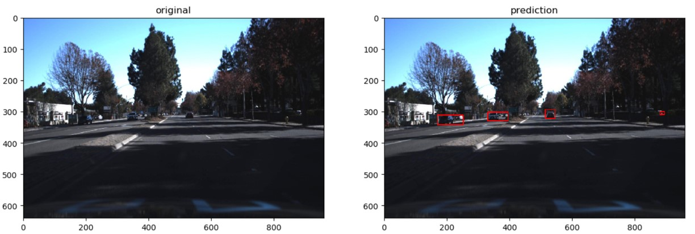
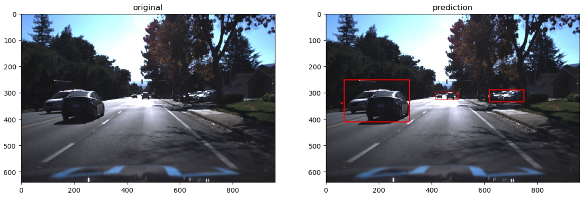
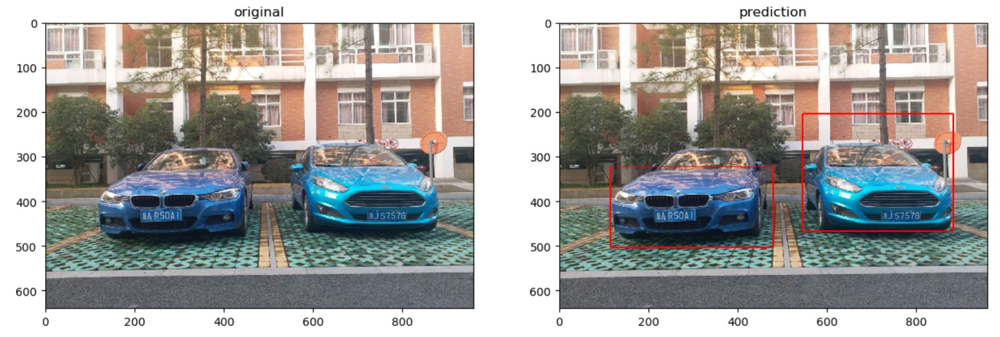

# Object detection
Semantic segmentation method for vehicles detection 

# Dependence
* python 3.6
* tensorflow 1.6
* tensorboard

# Data
* It consists of 9211 images with 1920x1200 resolution
* [Down Load Data](https://s3.amazonaws.com/udacity-sdc/annotations/object-detection-crowdai.tar.gz)

# Data convert
* python data_convert.py
* resize images to 960*640
* generate mask images

# Split training data and test data
* python split_data.py
* split 3/4 as training data,1/4 as test data

# Loss Function
* optimize IOU 

# Train
* python train.py

# Test model
* python test_model.py

# Result
* 16 FPS on TITAN X (Pascal)

